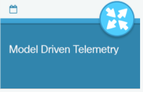
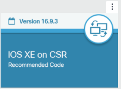
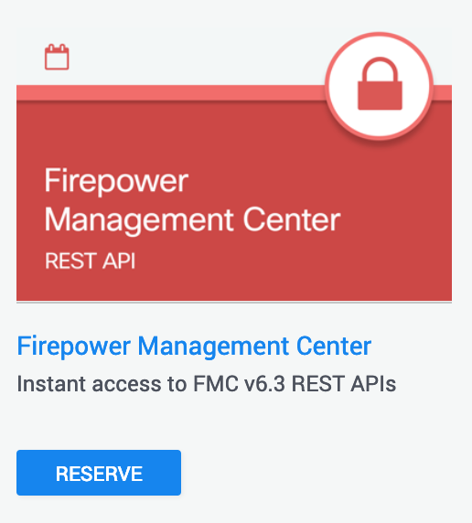
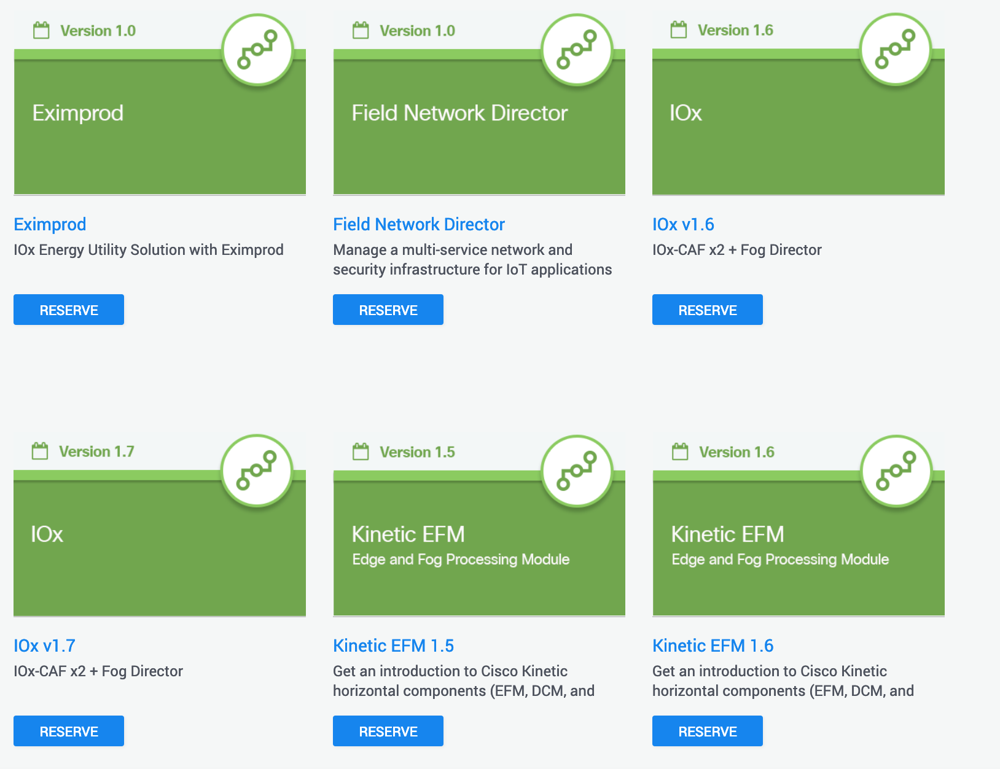

# Hackfest - Resources

# Event Name

# Event Schedule and Activities 

# What to Expect 

# Coding Basics
**Getting started with Coding and APIs** - [DevNet StartNow](https://developer.cisco.com/startnow/#coding-apis-v0)
# Frontend code

# Networking
### Sandboxes 
Available [sandboxes by Networking category](https://devnetsandbox.cisco.com/RM/Topology?c=14ec7ccf-2988-474e-a135-1e90b9bc6caf)

`You can also use Cisco DNA Center sandboxes`

- **Cisco DNA-C 1.3.1.4 - [DNAC Sandbox #1](https://sandboxdnac.cisco.com/)**

>login: devnetuser

>password: Cisco123!

- **Cisco DNA-C 1.3.1.6 - [DNAC Sandbox #2](https://sandboxdnac2.cisco.com)**

>login: devnetuser

>password: Cisco123!

`You can also use Cisco SD-WAN sandbox`

- **Cisco SDWAN (v18.3) - [SDWAN Sandbox](https://sandboxsdwan.cisco.com:8443/)**

>login: devnetuser

>password: Cisco123!

`You can also use Cisco Meraki`

- **Cisco Meraki - [Meraki Sandbox](https://n149.meraki.com/login/dashboard_login?go=%2FDevNet-Always-On%2Fn%2FZV4Dxbvc%2Fmanage%2Fusage%2Flist&sh=149)**

>login: devnetmeraki@cisco.com

>password: ilovemeraki

>API key: 6bec40cf957de430a6f1f2baa056b99a4fac9ea0

`You can also use Model Driven Telemetry Sandboxes`

- **Model Driven Telemetry Sandboxes -** [MDT Sandbox](https://devnetsandbox.cisco.com/RM/Diagram/Index/0e053963-b039-4a15-94f6-54db2f5ad61c?diagramType=Topology)

`You can also use Device Level programability Sandboxes`

- **Device Level Programmability -** [IOS-XE Sandbox](https://devnetsandbox.cisco.com/RM/Topology?c=14ec7ccf-2988-474e-a135-1e90b9bc6caf)

### Getting started with Networking
- [Introduction to Cisco DNA Center REST APIs](https://developer.cisco.com/learning/modules/dnac-rest-apis)
- [Cisco DNA Center documentation](https://developer.cisco.com/docs/dna-center/)
- [Introduction to Model Driven Programmability](https://developer.cisco.com/learning/modules/intro-device-level-interfaces)
- [IOS XE Model Driven Telemetry](https://developer.cisco.com/learning/modules/iosxe_telemetry)
- [Intro to Cisco SDWAN](https://developer.cisco.com/learning/modules/sd-wan)
- [Getting Started With Meraki](https://developer.cisco.com/learning/modules/getting-started-with-meraki)
- Looking for inspiration? Check these use cases on [DevNet Automation Exchange](https://developer.cisco.com/network-automation/listing/#domain=Campus%2FBranch)

# Security
#### Sandboxes 
Available [sandboxes by Security category](https://devnetsandbox.cisco.com/RM/Topology?c=a6f8430c-5b24-439d-b28a-effb42d4c20c)

For example, for firepower API's, check out the DevNet [FMC REST API Sandbox with FMC v6.3](https://devnetsandbox.cisco.com/RM/Diagram/Index/1228cb22-b2ba-48d3-a70a-86a53f4eecc0?diagramType=Topology)

Looking for inspiration? Check these Security use cases on [DevNet Automation Exchange](https://developer.cisco.com/network-automation/listing/#domain=Security)

## IoT

Available [sandboxes by IoT category](https://devnetsandbox.cisco.com/RM/Topology?c=171f6448-a74a-4831-a8c5-ad6f681bfc0d)

Looking for inspiration? Check these use cases on [DevNet Automation Exchange](https://developer.cisco.com/network-automation/listing/#domain=IoT)

## Containers and Cloud

You may find containerising your code and test databases makes it much easier to consistently build and deploy your project, for getting started information with Containerization and Docker, see our Microservices learning lab track:

[https://developer.cisco.com/learning/modules/cloud-native-development](https://developer.cisco.com/learning/modules/cloud-native-development)

## Other Useful links

- [Cisco DevNet Modules](https://developer.cisco.com/learning/modules)
- [Discover code repositories related to Cisco technologies](https://developer.cisco.com/codeexchange/)
- [Discover code and use cases related to Cisco technologies](https://developer.cisco.com/network-automation/)
- [Cisco Ecosystem Exchange](https://developer.cisco.com/ecosystem)
- [Cisco DevNet github](https://github.com/CiscoDevNet)
- [Sandbox Labs](https://devnetsandbox.cisco.com/RM/Topology)

